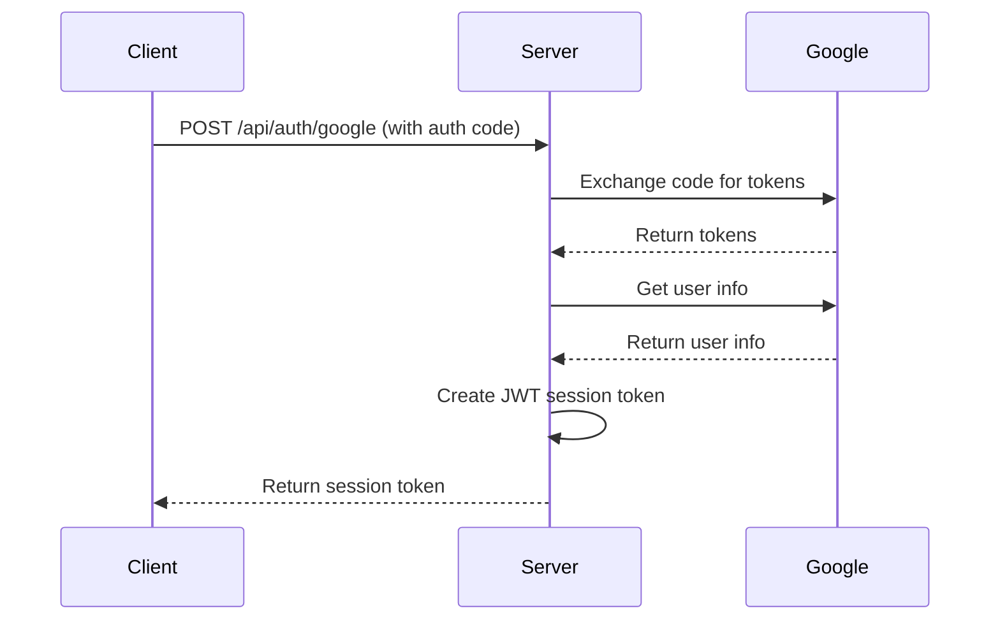
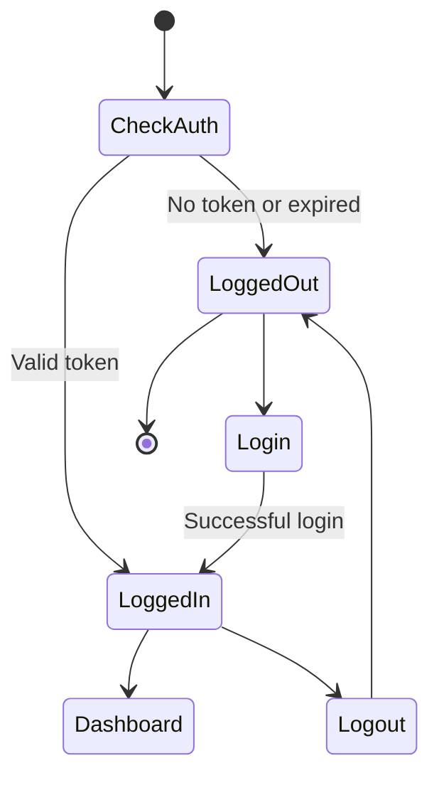

# NextJS Secure Request Processing Web App

This is a NextJS-based web application that focuses on secure request processing. It includes features like authentication, a dashboard, and theming capabilities.

## Features

- NextJS framework for server-side rendering and optimal performance
- Authentication system with Google integration
- Dashboard for authenticated users
- Theme switching capability
- Responsive design with Tailwind CSS
- Docker support for easy deployment and development

## Authentication Flow

### Server-side Authentication

The server-side authentication process is handled in the `app/api/auth/google/route.ts` file. Here's a diagram of the flow:



### Client-side Authentication

The client-side authentication is managed by the `useAuth` hook in `app/hooks/useAuth.ts`. Here's a diagram of the authentication flow:



## Project Structure

```
.
├── app/
│   ├── api/
│   │   └── auth/
│   │       └── google/
│   ├── components/
│   ├── dashboard/
│   ├── hooks/
│   └── login/
├── config/
├── pages/
│   └── api/
├── public/
├── styles/
├── types/
├── .dockerignore
├── .env
├── .eslintignore
├── .eslintrc.json
├── .gitignore
├── .npmrc
├── docker-compose.yml
├── Dockerfile
├── LICENSE
├── next.config.js
├── package.json
├── postcss.config.js
├── README.md
├── tailwind.config.js
└── tsconfig.json
```

## Prerequisites

- Node.js (v14 or later)
- npm or yarn
- Docker and Docker Compose

## Installation

1. Clone the repository:
   ```
   git clone <repository-url>
   cd secure-request-processing-web-app
   ```

2. Install dependencies:
   ```
   npm install
   ```
   or
   ```
   yarn install
   ```

3. Set up environment variables:
   Create a `.env` file in the root directory and add the necessary environment variables. You can use the `.env.example` file as a template if provided. Your `.env` file should look like this:

   ```
   NEXT_PUBLIC_GOOGLE_CLIENT_ID=your_google_client_id
   NEXT_PUBLIC_GOOGLE_CLIENT_SECRET=your_google_client_secret
   NEXT_PUBLIC_BASE_URL=http://localhost:3000
   NEXTAUTH_SECRET=your_nextauth_secret
   NEXT_PUBLIC_JWT_SECRET=your_jwt_secret
   ```

   Replace `your_google_client_id`, `your_google_client_secret`, `your_nextauth_secret`, and `your_jwt_secret` with your actual values. The `NEXT_PUBLIC_BASE_URL` can remain as `http://localhost:3000` for local development.

   Note: Make sure to keep your `.env` file secure and never commit it to version control. Add it to your `.gitignore` file if it's not already there.


## Running the Project

### Development Mode

To run the project in development mode:

```
npm run dev
```
or
```
yarn dev
```

### Production Mode

To build and run the project in production mode:

```
npm run build
npm start
```
or
```
yarn build
yarn start
```

### Using Docker Compose

To run the project using Docker Compose:

1. Make sure you have Docker and Docker Compose installed on your system.

2. Create a `.env` file in the root directory with the necessary environment variables.

3. Run the following command:

```
docker compose --env-file .env up --build
```

This command will build the Docker image (if not already built or if there are changes) and start the containers defined in the `docker-compose.yml` file. The `--env-file .env` flag ensures that the environment variables from the `.env` file are used.

To stop the containers, use:

```
docker compose down
```

## Contributing

Contributions are welcome! Please feel free to submit a Pull Request.

1. Fork the repository
2. Create your feature branch (`git checkout -b feature/AmazingFeature`)
3. Commit your changes (`git commit -m 'Add some AmazingFeature'`)
4. Push to the branch (`git push origin feature/AmazingFeature`)
5. Open a Pull Request

## License

This project is licensed under the terms of the license file included in the repository. See the [LICENSE](LICENSE) file for details.
